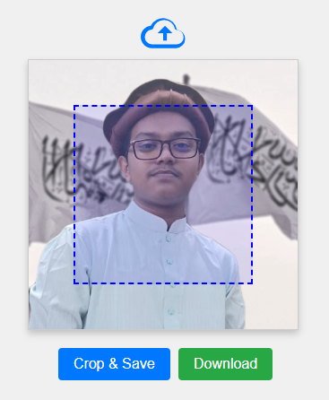

# Profile Picture Crop System

This project is a simple web-based profile picture cropping tool. Users can upload an image, adjust a crop area, and download the cropped portion of the image as a new file. This tool is useful for applications where users need to set or edit profile pictures with a specified aspect ratio.

## Demo

## Features

- **Image Upload**: Allows users to upload an image file from their local system.
- **Crop Area Adjustment**: Provides a draggable crop area that users can move and position over the image.
- **Image Cropping**: Crops the selected area of the image based on the crop area and prepares it for download.
- **Download Functionality**: Enables users to download the cropped image as a PNG file.

## Technologies Used

- HTML, CSS, and JavaScript for the frontend structure, styling, and interactivity.
- Canvas API for rendering and cropping the image.

